# Just Dance AI - Sequence Diagram

This document illustrates the complete system flow from entering a YouTube URL to receiving real-time scoring feedback.

## System Architecture Flow

```mermaid
sequenceDiagram
    actor User
    participant Browser as Browser<br/>(page.tsx)
    participant API as Next.js API<br/>(/api/process-video)
    participant Python as Python Script<br/>(process_video.py)
    participant YT as YouTube<br/>(yt-dlp)
    participant MP as MediaPipe
    participant FFmpeg
    participant Canvas as DanceCanvas<br/>(DanceCanvas.tsx)
    participant Webcam
    participant Detector as Pose Detector<br/>(poseDetector.ts)
    participant Compare as Pose Compare<br/>(poseComparison.ts)

    Note over User,Compare: Phase 1: Enter YouTube Link
    User->>Browser: Input YouTube URL
    User->>Browser: Click "Let's Party"
    Browser->>Browser: parseVideoId(url)
    Browser->>Browser: setProcessingStatus("Starting...")
    
    Note over User,Compare: Phase 2: Video Preprocessing
    Browser->>API: POST /api/process-video<br/>{videoId, url}
    API->>API: Check if already processed
    alt Video Not Processed
        API->>Python: spawn process_video.py<br/>[url, videoId]
        API-->>Browser: {status: "started"}
        Browser->>Browser: Start polling every 3s
        
        Python->>YT: Download video
        YT-->>Python: Raw video file
        
        Python->>Python: Initialize MediaPipe Pose
        Python->>MP: Process each frame
        
        loop Every Frame
            MP-->>Python: Pose landmarks
            Python->>Python: Draw skeleton on black frame
            
            alt Every 0.5 seconds
                Python->>Python: Save landmarks to action_mesh[]
            end
            
            Python->>FFmpeg: Stream skeleton frame
        end
        
        FFmpeg->>FFmpeg: Combine skeleton video + original audio
        FFmpeg-->>Python: Output video file
        
        Python->>Python: Save video to public/processed/{id}.mp4
        Python->>Python: Save JSON to public/processed/{id}_action_mesh.json
        Python-->>API: Process complete
        
        loop Polling
            Browser->>API: GET /api/process-video?videoId={id}
            alt Processing Complete
                API-->>Browser: {status: "completed", videoUrl}
                Browser->>Browser: setProcessedVideoUrl(videoUrl)
                Browser->>Browser: setYoutubeId(id)
            else Still Processing
                API-->>Browser: {status: "processing"}
            end
        end
    else Already Processed
        API-->>Browser: {status: "completed", videoUrl}
    end
    
    Note over User,Compare: Phase 3: Real-Time Scoring
    Browser->>Canvas: Render DanceCanvas component<br/>{processedVideoUrl}
    Canvas->>Canvas: Fetch action_mesh.json
    Canvas->>Detector: Initialize pose detector
    Canvas->>Webcam: Request camera access
    Webcam-->>Canvas: Video stream
    
    Canvas->>Canvas: Start video playback (processedVideoRef)
    
    par Video Playback & User Detection
        Canvas->>Canvas: Video plays (skeleton animation)
        
        loop Every Frame (60fps)
            Webcam->>Detector: Send webcam frame
            Detector->>MP: Process user pose
            MP-->>Detector: User pose landmarks
            Detector->>Canvas: onResults(userPose)
            
            Canvas->>Canvas: Get current video time
            Canvas->>Compare: findNearestCheckpoint(actionMesh, time)
            Compare-->>Canvas: Target checkpoint
            
            alt Checkpoint Found & Not Recently Scored
                Canvas->>Compare: resultsToLandmarks(userPose)
                Compare-->>Canvas: User landmarks array
                
                Canvas->>Compare: calculatePoseSimilarity(user, target)
                Compare->>Compare: Calculate Euclidean distance
                Compare->>Compare: Weight important joints
                Compare-->>Canvas: Similarity score (0-100)
                
                Canvas->>Compare: getScoreFeedback(similarity)
                Compare-->>Canvas: {feedback, points}
                
                alt Points > 0
                    Canvas->>Browser: onScoreUpdate(points, feedback)
                    Browser->>Browser: Update score display
                    Browser->>User: Show "Perfect! 🔥" / "Great! ⭐"
                end
            end
            
            Canvas->>Canvas: drawPose(userPose) on right canvas
        end
    end
    
    User->>Browser: Click "Stop Session"
    Browser->>Canvas: Unmount component
    Canvas->>Detector: Close detector
    Canvas->>Webcam: Stop stream
```



## Detailed Phase Breakdown

### Phase 1: URL Input
**Duration**: Instant  
**Components**: Frontend (page.tsx)

1. User enters YouTube URL in input field
2. Frontend validates and extracts video ID using regex patterns
3. Processing state is initialized

**Key Files**:
- `src/app/page.tsx` - Main UI and state management

---

### Phase 2: Video Preprocessing
**Duration**: 10 seconds - 2 minutes (depends on video length)  
**Components**: Next.js API, Python Script, External Services

**Processing Pipeline**:

1. **API Request** (`/api/process-video`)
   - Checks if video already processed
   - Creates lock file to prevent duplicate processing
   - Spawns Python subprocess

2. **Video Download** (yt-dlp)
   - Downloads best quality video ≤720p
   - Saves to temporary directory

3. **Pose Extraction** (MediaPipe)
   - Processes video frame-by-frame
   - Extracts 33 3D pose landmarks per frame
   - Tracks visibility scores for each joint

4. **Checkpoint Creation**
   - Every 0.5 seconds (based on FPS):
     - Saves normalized landmark coordinates
     - Stores in action_mesh array
   - Creates temporal reference points for scoring

5. **Skeleton Rendering**
   - Draws pose connections on black background
   - Uses green lines and white joints
   - Streams to FFmpeg via stdin

6. **Audio Synchronization**
   - FFmpeg combines skeleton video with original audio
   - Encodes as H.264/AAC MP4
   - Ensures frame-perfect synchronization

7. **Output Generation**
   - `{videoId}.mp4` → Skeleton animation video
   - `{videoId}_action_mesh.json` → Pose checkpoint data

**Key Files**:
- `src/app/api/process-video/route.ts` - API endpoint
- `scripts/process_video.py` - Video processing pipeline
- `scripts/requirements.txt` - Python dependencies

---

### Phase 3: Real-Time Scoring
**Duration**: Continuous during playback  
**Components**: Frontend (DanceCanvas, Detectors, Comparison Utils)

**Real-Time Loop** (60 FPS):

1. **Dual Video Processing**
   - **Left**: Skeleton reference video plays
   - **Right**: Webcam feed captures user

2. **Pose Detection**
   - MediaPipe processes webcam frame
   - Extracts user's 33 landmark positions
   - Renders skeleton overlay on webcam

3. **Temporal Synchronization**
   - Tracks current video playback time
   - Finds nearest checkpoint in action_mesh (±0.3s tolerance)

4. **Similarity Calculation**
   - Computes Euclidean distance for each joint pair
   - Applies weighted scoring:
     - **High weight** (2.0x): Shoulders, hips, elbows, knees
     - **Standard weight** (1.0x): Other joints
   - Normalizes to 0-100% similarity

5. **Score Feedback**
   - **Perfect! 🔥** (≥90%): +100 points
   - **Great! ⭐** (70-89%): +50 points
   - **Good! 👍** (50-69%): +25 points
   - Below 50%: No points

6. **Anti-Duplicate Logic**
   - Prevents scoring same checkpoint multiple times
   - Requires ≥0.4s gap between scores

**Key Files**:
- `src/components/DanceCanvas.tsx` - Main game component
- `src/utils/poseDetector.ts` - MediaPipe wrapper
- `src/utils/poseComparison.ts` - Similarity algorithms

---

## Technology Stack

| Layer | Technology | Purpose |
|-------|-----------|---------|
| **Frontend** | Next.js 16, React 19, TypeScript | UI and state management |
| **Backend** | Next.js API Routes | Request handling and process spawning |
| **Video Processing** | Python 3.12 | Server-side video manipulation |
| **Pose Estimation** | MediaPipe 0.10 | ML-based pose detection |
| **Video Tools** | FFmpeg, yt-dlp, OpenCV | Download, process, encode |
| **Storage** | Static files (`public/processed/`) | Processed videos and JSON data |

---

## Data Flow Summary

```
YouTube URL
    ↓
Video Download (yt-dlp)
    ↓
Frame Extraction (OpenCV)
    ↓
Pose Detection (MediaPipe) ──→ Checkpoint JSON (0.5s intervals)
    ↓
Skeleton Rendering
    ↓
Video Encoding (FFmpeg + Audio)
    ↓
Processed Video MP4
    ↓
Browser Playback ──→ Load Checkpoints
    ↓              ↓
Webcam Feed    Reference Poses
    ↓              ↓
User Pose  ←→  Similarity Calc
    ↓
Score Update
```

---

## File Outputs

### Processed Video
**Path**: `public/processed/{videoId}.mp4`  
**Format**: H.264 video, AAC audio, MP4 container  
**Content**: Skeleton animation on black background with original audio

### Action Mesh JSON
**Path**: `public/processed/{videoId}_action_mesh.json`  
**Format**: JSON array  
**Structure**:
```json
[
  {
    "time": 0.5,
    "landmarks": [
      {"x": 0.5, "y": 0.3, "z": -0.1, "visibility": 0.99},
      ...33 landmarks total
    ]
  },
  ...continues every 0.5s
]
```

---

## Performance Considerations

- **Video Processing**: CPU-intensive, runs async with polling
- **Real-Time Detection**: 60 FPS animation loop, ~16ms per frame
- **Comparison**: O(n) where n=33 landmarks, negligible overhead
- **Memory**: Action mesh ~10-50KB per minute of video
- **Network**: One-time fetch of video + JSON after processing
